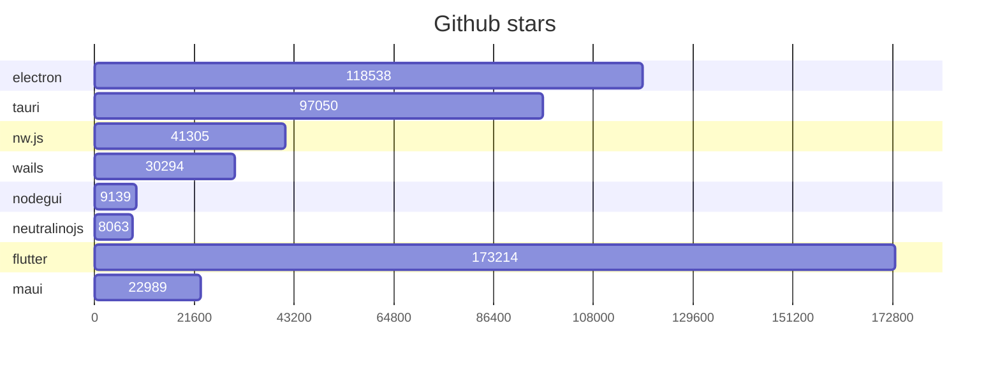

# Graphs

## Stars

```mermaid
gantt
    title Github stars
    dateFormat  X
    axisFormat %s


	section electron
	118538 : 0, 118538

	
	section tauri
	97050 : 0, 97050

	
	section nw.js
	41305 : 0, 41305

	
	section wails
	30294 : 0, 30294

	
	section nodegui
	9139 : 0, 9139

	
	section neutralinojs
	8063 : 0, 8063

	
	section flutter
	173214 : 0, 173214

	
	section maui
	22989 : 0, 22989

	
```

## Forks

```mermaid
gantt
    title Github forks
    dateFormat  X
    axisFormat %s


	section electron
	16474 : 0, 16474

	
	section tauri
	3081 : 0, 3081

	
	section nw.js
	3882 : 0, 3882

	
	section wails
	1478 : 0, 1478

	
	section nodegui
	308 : 0, 308

	
	section neutralinojs
	416 : 0, 416

	
	section flutter
	29290 : 0, 29290

	
	section maui
	1884 : 0, 1884

	
```
