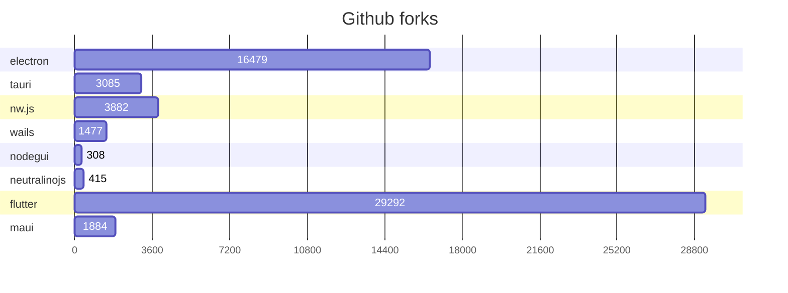

# Graphs

## Stars

```mermaid
gantt
    title Github stars
    dateFormat  X
    axisFormat %s


	section electron
	118541 : 0, 118541

	
	section tauri
	97063 : 0, 97063

	
	section nw.js
	41312 : 0, 41312

	
	section wails
	30300 : 0, 30300

	
	section nodegui
	9137 : 0, 9137

	
	section neutralinojs
	8061 : 0, 8061

	
	section flutter
	173221 : 0, 173221

	
	section maui
	22993 : 0, 22993

	
```

## Forks

```mermaid
gantt
    title Github forks
    dateFormat  X
    axisFormat %s


	section electron
	16479 : 0, 16479

	
	section tauri
	3085 : 0, 3085

	
	section nw.js
	3882 : 0, 3882

	
	section wails
	1477 : 0, 1477

	
	section nodegui
	308 : 0, 308

	
	section neutralinojs
	415 : 0, 415

	
	section flutter
	29292 : 0, 29292

	
	section maui
	1884 : 0, 1884

	
```
