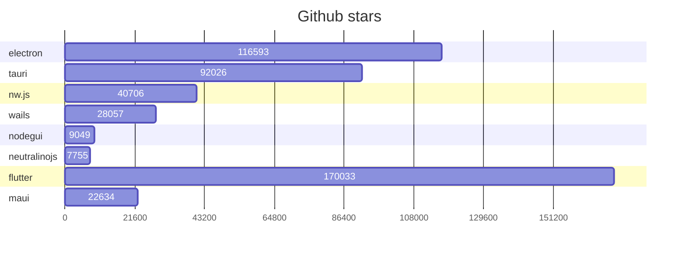

# Graphs

## Stars

```mermaid
gantt
    title Github stars
    dateFormat  X
    axisFormat %s


	section electron
	116593 : 0, 116593

	
	section tauri
	92026 : 0, 92026

	
	section nw.js
	40706 : 0, 40706

	
	section wails
	28057 : 0, 28057

	
	section nodegui
	9049 : 0, 9049

	
	section neutralinojs
	7755 : 0, 7755

	
	section flutter
	170033 : 0, 170033

	
	section maui
	22634 : 0, 22634

	
```

## Forks

```mermaid
gantt
    title Github forks
    dateFormat  X
    axisFormat %s


	section electron
	16011 : 0, 16011

	
	section tauri
	2827 : 0, 2827

	
	section nw.js
	3877 : 0, 3877

	
	section wails
	1365 : 0, 1365

	
	section nodegui
	303 : 0, 303

	
	section neutralinojs
	405 : 0, 405

	
	section flutter
	28448 : 0, 28448

	
	section maui
	1825 : 0, 1825

	
```
