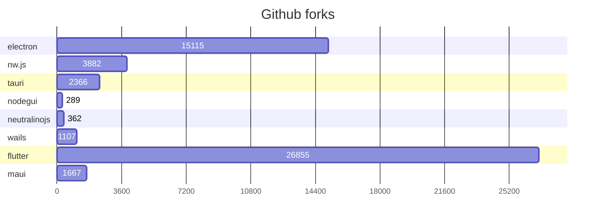

# Graphs

## Stars

```mermaid
gantt
    title Github stars
    dateFormat  X
    axisFormat %s


	section electron
	112757 : 0, 112757

	
	section nw.js
	40220 : 0, 40220

	
	section tauri
	79617 : 0, 79617

	
	section nodegui
	8812 : 0, 8812

	
	section neutralinojs
	7328 : 0, 7328

	
	section wails
	23339 : 0, 23339

	
	section flutter
	163146 : 0, 163146

	
	section maui
	21833 : 0, 21833

	
```

## Forks

```mermaid
gantt
    title Github forks
    dateFormat  X
    axisFormat %s


	section electron
	15115 : 0, 15115

	
	section nw.js
	3882 : 0, 3882

	
	section tauri
	2366 : 0, 2366

	
	section nodegui
	289 : 0, 289

	
	section neutralinojs
	362 : 0, 362

	
	section wails
	1107 : 0, 1107

	
	section flutter
	26855 : 0, 26855

	
	section maui
	1667 : 0, 1667

	
```
