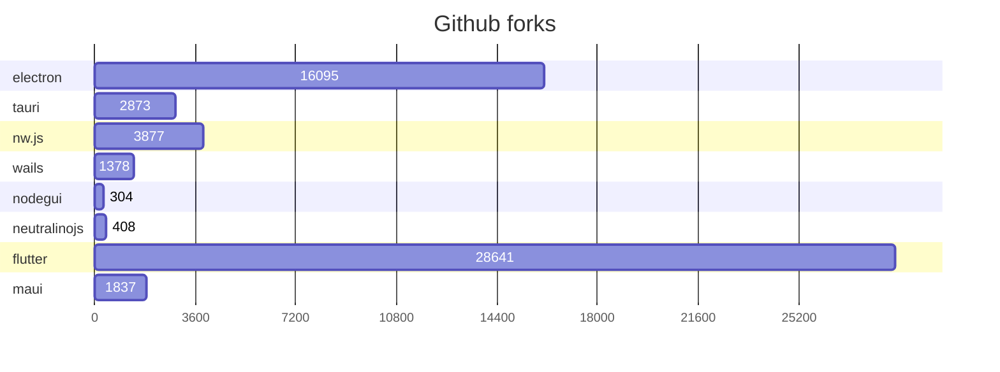

# Graphs

## Stars

```mermaid
gantt
    title Github stars
    dateFormat  X
    axisFormat %s


	section electron
	116977 : 0, 116977

	
	section tauri
	93063 : 0, 93063

	
	section nw.js
	40788 : 0, 40788

	
	section wails
	28445 : 0, 28445

	
	section nodegui
	9070 : 0, 9070

	
	section neutralinojs
	7831 : 0, 7831

	
	section flutter
	170690 : 0, 170690

	
	section maui
	22703 : 0, 22703

	
```

## Forks

```mermaid
gantt
    title Github forks
    dateFormat  X
    axisFormat %s


	section electron
	16095 : 0, 16095

	
	section tauri
	2873 : 0, 2873

	
	section nw.js
	3877 : 0, 3877

	
	section wails
	1378 : 0, 1378

	
	section nodegui
	304 : 0, 304

	
	section neutralinojs
	408 : 0, 408

	
	section flutter
	28641 : 0, 28641

	
	section maui
	1837 : 0, 1837

	
```
