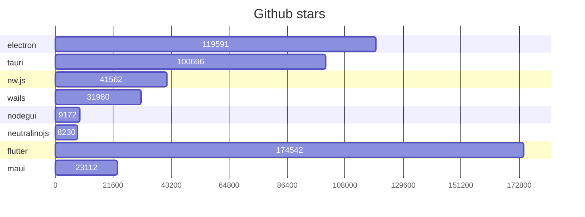

# Graphs

## Stars

```mermaid
gantt
    title Github stars
    dateFormat  X
    axisFormat %s


	section electron
	119591 : 0, 119591

	
	section tauri
	100696 : 0, 100696

	
	section nw.js
	41562 : 0, 41562

	
	section wails
	31980 : 0, 31980

	
	section nodegui
	9172 : 0, 9172

	
	section neutralinojs
	8230 : 0, 8230

	
	section flutter
	174542 : 0, 174542

	
	section maui
	23112 : 0, 23112

	
```

## Forks

```mermaid
gantt
    title Github forks
    dateFormat  X
    axisFormat %s


	section electron
	16887 : 0, 16887

	
	section tauri
	3266 : 0, 3266

	
	section nw.js
	3875 : 0, 3875

	
	section wails
	1546 : 0, 1546

	
	section nodegui
	308 : 0, 308

	
	section neutralinojs
	436 : 0, 436

	
	section flutter
	29778 : 0, 29778

	
	section maui
	1907 : 0, 1907

	
```
