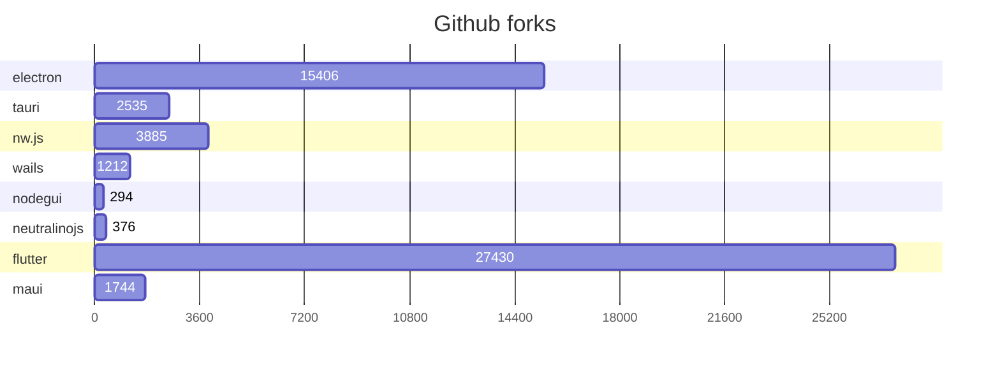

# Graphs

## Stars

```mermaid
gantt
    title Github stars
    dateFormat  X
    axisFormat %s


	section electron
	114283 : 0, 114283

	
	section tauri
	84341 : 0, 84341

	
	section nw.js
	40377 : 0, 40377

	
	section wails
	25187 : 0, 25187

	
	section nodegui
	8907 : 0, 8907

	
	section neutralinojs
	7459 : 0, 7459

	
	section flutter
	166121 : 0, 166121

	
	section maui
	22207 : 0, 22207

	
```

## Forks

```mermaid
gantt
    title Github forks
    dateFormat  X
    axisFormat %s


	section electron
	15406 : 0, 15406

	
	section tauri
	2535 : 0, 2535

	
	section nw.js
	3885 : 0, 3885

	
	section wails
	1212 : 0, 1212

	
	section nodegui
	294 : 0, 294

	
	section neutralinojs
	376 : 0, 376

	
	section flutter
	27430 : 0, 27430

	
	section maui
	1744 : 0, 1744

	
```
