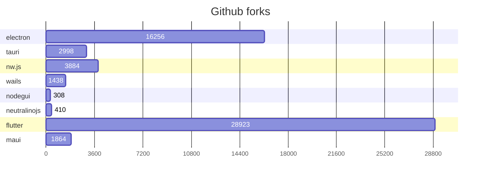

# Graphs

## Stars

```mermaid
gantt
    title Github stars
    dateFormat  X
    axisFormat %s


	section electron
	117694 : 0, 117694

	
	section tauri
	95122 : 0, 95122

	
	section nw.js
	40988 : 0, 40988

	
	section wails
	29383 : 0, 29383

	
	section nodegui
	9111 : 0, 9111

	
	section neutralinojs
	7949 : 0, 7949

	
	section flutter
	171632 : 0, 171632

	
	section maui
	22822 : 0, 22822

	
```

## Forks

```mermaid
gantt
    title Github forks
    dateFormat  X
    axisFormat %s


	section electron
	16256 : 0, 16256

	
	section tauri
	2998 : 0, 2998

	
	section nw.js
	3884 : 0, 3884

	
	section wails
	1438 : 0, 1438

	
	section nodegui
	308 : 0, 308

	
	section neutralinojs
	410 : 0, 410

	
	section flutter
	28923 : 0, 28923

	
	section maui
	1864 : 0, 1864

	
```
