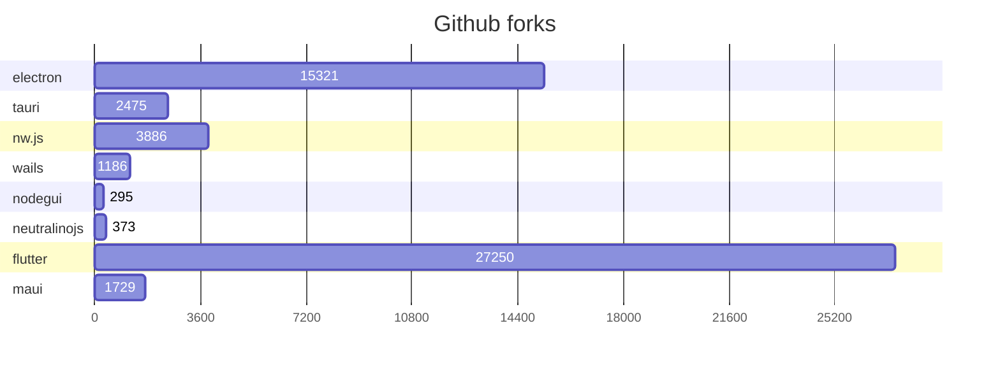

# Graphs

## Stars

```mermaid
gantt
    title Github stars
    dateFormat  X
    axisFormat %s


	section electron
	113812 : 0, 113812

	
	section tauri
	82402 : 0, 82402

	
	section nw.js
	40319 : 0, 40319

	
	section wails
	24699 : 0, 24699

	
	section nodegui
	8876 : 0, 8876

	
	section neutralinojs
	7442 : 0, 7442

	
	section flutter
	165172 : 0, 165172

	
	section maui
	22038 : 0, 22038

	
```

## Forks

```mermaid
gantt
    title Github forks
    dateFormat  X
    axisFormat %s


	section electron
	15321 : 0, 15321

	
	section tauri
	2475 : 0, 2475

	
	section nw.js
	3886 : 0, 3886

	
	section wails
	1186 : 0, 1186

	
	section nodegui
	295 : 0, 295

	
	section neutralinojs
	373 : 0, 373

	
	section flutter
	27250 : 0, 27250

	
	section maui
	1729 : 0, 1729

	
```
