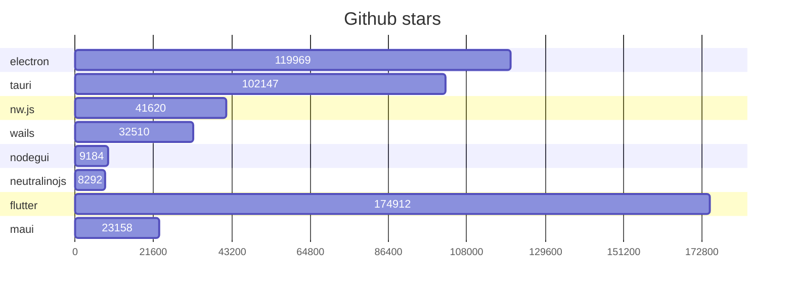
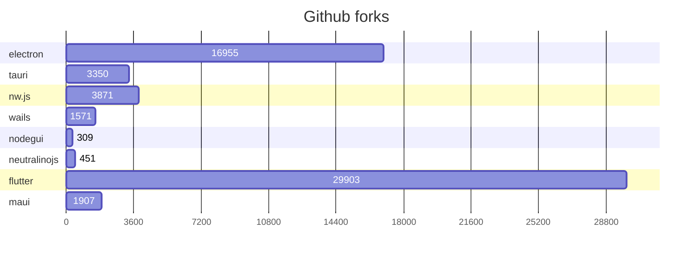

# Graphs

## Stars

```mermaid
gantt
    title Github stars
    dateFormat  X
    axisFormat %s


	section electron
	119969 : 0, 119969

	
	section tauri
	102147 : 0, 102147

	
	section nw.js
	41620 : 0, 41620

	
	section wails
	32510 : 0, 32510

	
	section nodegui
	9184 : 0, 9184

	
	section neutralinojs
	8292 : 0, 8292

	
	section flutter
	174912 : 0, 174912

	
	section maui
	23158 : 0, 23158

	
```

## Forks

```mermaid
gantt
    title Github forks
    dateFormat  X
    axisFormat %s


	section electron
	16955 : 0, 16955

	
	section tauri
	3350 : 0, 3350

	
	section nw.js
	3871 : 0, 3871

	
	section wails
	1571 : 0, 1571

	
	section nodegui
	309 : 0, 309

	
	section neutralinojs
	451 : 0, 451

	
	section flutter
	29903 : 0, 29903

	
	section maui
	1907 : 0, 1907

	
```
