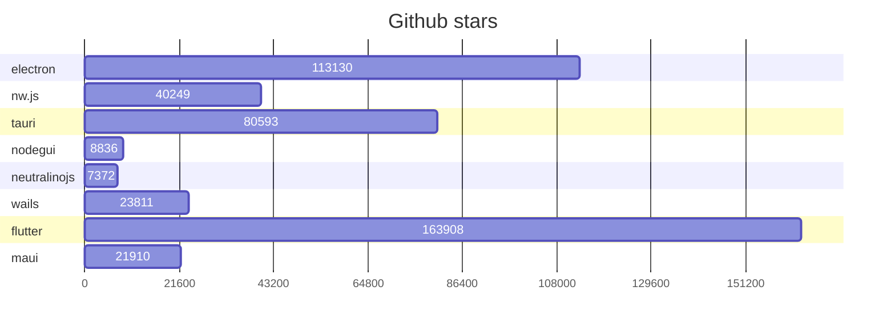

# Graphs

## Stars

```mermaid
gantt
    title Github stars
    dateFormat  X
    axisFormat %s


	section electron
	113130 : 0, 113130

	
	section nw.js
	40249 : 0, 40249

	
	section tauri
	80593 : 0, 80593

	
	section nodegui
	8836 : 0, 8836

	
	section neutralinojs
	7372 : 0, 7372

	
	section wails
	23811 : 0, 23811

	
	section flutter
	163908 : 0, 163908

	
	section maui
	21910 : 0, 21910

	
```

## Forks

```mermaid
gantt
    title Github forks
    dateFormat  X
    axisFormat %s


	section electron
	15194 : 0, 15194

	
	section nw.js
	3885 : 0, 3885

	
	section tauri
	2409 : 0, 2409

	
	section nodegui
	289 : 0, 289

	
	section neutralinojs
	364 : 0, 364

	
	section wails
	1141 : 0, 1141

	
	section flutter
	27005 : 0, 27005

	
	section maui
	1692 : 0, 1692

	
```
