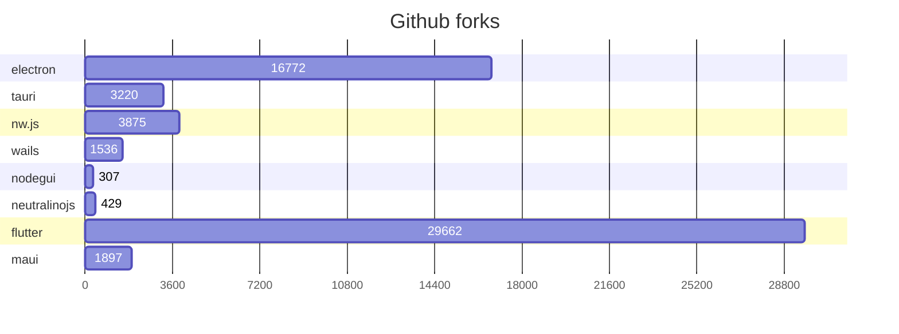

# Graphs

## Stars

```mermaid
gantt
    title Github stars
    dateFormat  X
    axisFormat %s


	section electron
	119319 : 0, 119319

	
	section tauri
	99808 : 0, 99808

	
	section nw.js
	41512 : 0, 41512

	
	section wails
	31627 : 0, 31627

	
	section nodegui
	9164 : 0, 9164

	
	section neutralinojs
	8190 : 0, 8190

	
	section flutter
	174219 : 0, 174219

	
	section maui
	23078 : 0, 23078

	
```

## Forks

```mermaid
gantt
    title Github forks
    dateFormat  X
    axisFormat %s


	section electron
	16772 : 0, 16772

	
	section tauri
	3220 : 0, 3220

	
	section nw.js
	3875 : 0, 3875

	
	section wails
	1536 : 0, 1536

	
	section nodegui
	307 : 0, 307

	
	section neutralinojs
	429 : 0, 429

	
	section flutter
	29662 : 0, 29662

	
	section maui
	1897 : 0, 1897

	
```
