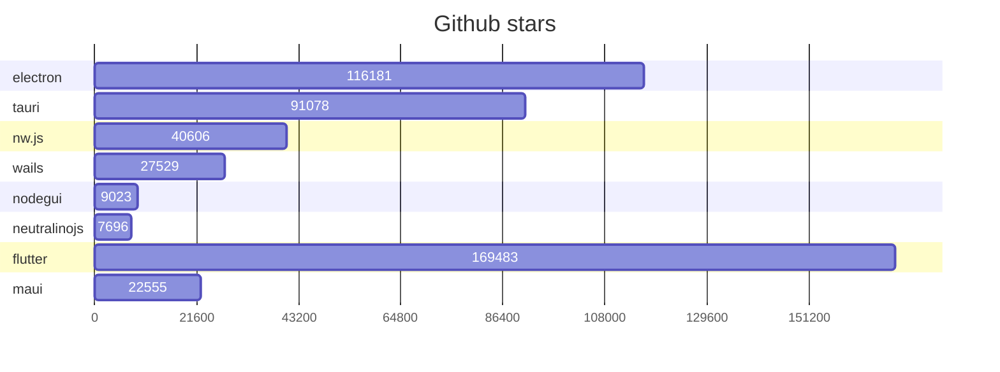

# Graphs

## Stars

```mermaid
gantt
    title Github stars
    dateFormat  X
    axisFormat %s


	section electron
	116181 : 0, 116181

	
	section tauri
	91078 : 0, 91078

	
	section nw.js
	40606 : 0, 40606

	
	section wails
	27529 : 0, 27529

	
	section nodegui
	9023 : 0, 9023

	
	section neutralinojs
	7696 : 0, 7696

	
	section flutter
	169483 : 0, 169483

	
	section maui
	22555 : 0, 22555

	
```

## Forks

```mermaid
gantt
    title Github forks
    dateFormat  X
    axisFormat %s


	section electron
	15951 : 0, 15951

	
	section tauri
	2790 : 0, 2790

	
	section nw.js
	3881 : 0, 3881

	
	section wails
	1333 : 0, 1333

	
	section nodegui
	302 : 0, 302

	
	section neutralinojs
	402 : 0, 402

	
	section flutter
	28272 : 0, 28272

	
	section maui
	1805 : 0, 1805

	
```
