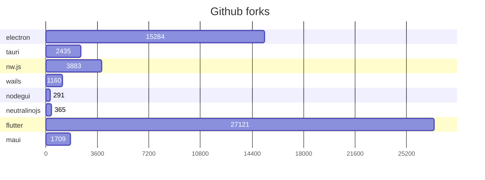

# Graphs

## Stars

```mermaid
gantt
    title Github stars
    dateFormat  X
    axisFormat %s


	section electron
	113625 : 0, 113625

	
	section tauri
	81492 : 0, 81492

	
	section nw.js
	40284 : 0, 40284

	
	section wails
	24259 : 0, 24259

	
	section nodegui
	8850 : 0, 8850

	
	section neutralinojs
	7402 : 0, 7402

	
	section flutter
	164378 : 0, 164378

	
	section maui
	21965 : 0, 21965

	
```

## Forks

```mermaid
gantt
    title Github forks
    dateFormat  X
    axisFormat %s


	section electron
	15284 : 0, 15284

	
	section tauri
	2435 : 0, 2435

	
	section nw.js
	3883 : 0, 3883

	
	section wails
	1160 : 0, 1160

	
	section nodegui
	291 : 0, 291

	
	section neutralinojs
	365 : 0, 365

	
	section flutter
	27121 : 0, 27121

	
	section maui
	1709 : 0, 1709

	
```
