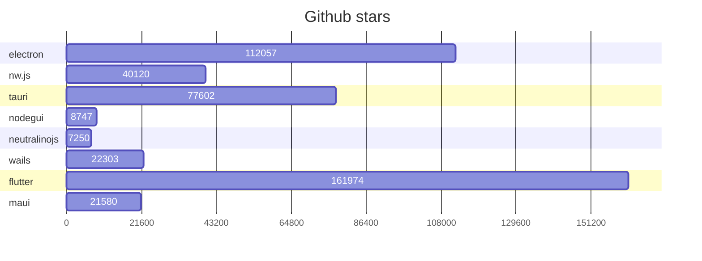

# Graphs

## Stars

```mermaid
gantt
    title Github stars
    dateFormat  X
    axisFormat %s


	section electron
	112057 : 0, 112057

	
	section nw.js
	40120 : 0, 40120

	
	section tauri
	77602 : 0, 77602

	
	section nodegui
	8747 : 0, 8747

	
	section neutralinojs
	7250 : 0, 7250

	
	section wails
	22303 : 0, 22303

	
	section flutter
	161974 : 0, 161974

	
	section maui
	21580 : 0, 21580

	
```

## Forks

```mermaid
gantt
    title Github forks
    dateFormat  X
    axisFormat %s


	section electron
	14940 : 0, 14940

	
	section nw.js
	3880 : 0, 3880

	
	section tauri
	2281 : 0, 2281

	
	section nodegui
	287 : 0, 287

	
	section neutralinojs
	356 : 0, 356

	
	section wails
	1057 : 0, 1057

	
	section flutter
	26591 : 0, 26591

	
	section maui
	1613 : 0, 1613

	
```
