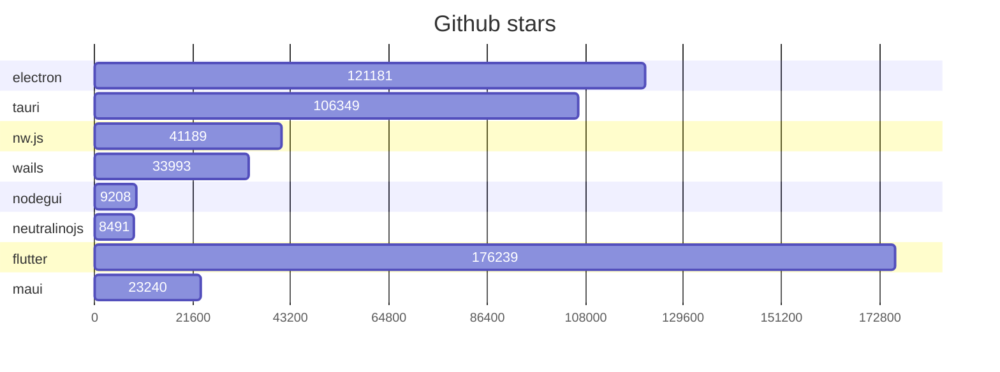

# Graphs

## Stars

```mermaid
gantt
    title Github stars
    dateFormat  X
    axisFormat %s


	section electron
	121181 : 0, 121181

	
	section tauri
	106349 : 0, 106349

	
	section nw.js
	41189 : 0, 41189

	
	section wails
	33993 : 0, 33993

	
	section nodegui
	9208 : 0, 9208

	
	section neutralinojs
	8491 : 0, 8491

	
	section flutter
	176239 : 0, 176239

	
	section maui
	23240 : 0, 23240

	
```

## Forks

```mermaid
gantt
    title Github forks
    dateFormat  X
    axisFormat %s


	section electron
	17183 : 0, 17183

	
	section tauri
	3582 : 0, 3582

	
	section nw.js
	3859 : 0, 3859

	
	section wails
	1678 : 0, 1678

	
	section nodegui
	312 : 0, 312

	
	section neutralinojs
	517 : 0, 517

	
	section flutter
	30335 : 0, 30335

	
	section maui
	1945 : 0, 1945

	
```
