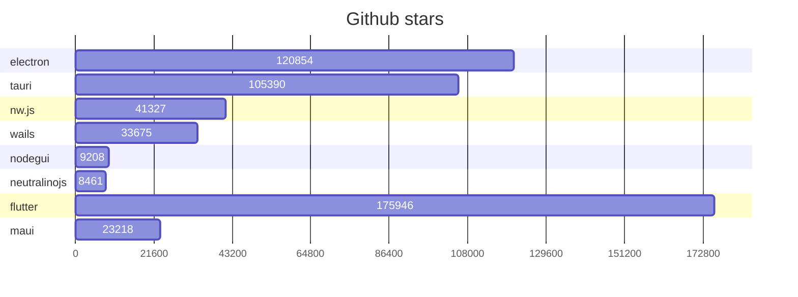
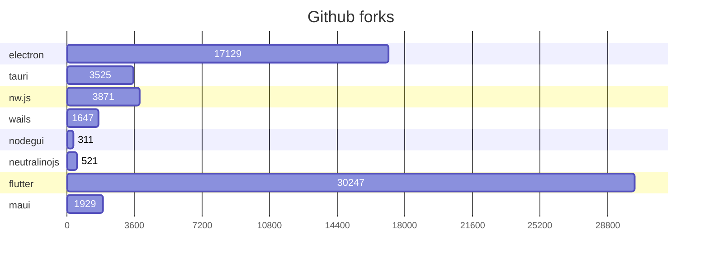

# Graphs

## Stars

```mermaid
gantt
    title Github stars
    dateFormat  X
    axisFormat %s


	section electron
	120854 : 0, 120854

	
	section tauri
	105390 : 0, 105390

	
	section nw.js
	41327 : 0, 41327

	
	section wails
	33675 : 0, 33675

	
	section nodegui
	9208 : 0, 9208

	
	section neutralinojs
	8461 : 0, 8461

	
	section flutter
	175946 : 0, 175946

	
	section maui
	23218 : 0, 23218

	
```

## Forks

```mermaid
gantt
    title Github forks
    dateFormat  X
    axisFormat %s


	section electron
	17129 : 0, 17129

	
	section tauri
	3525 : 0, 3525

	
	section nw.js
	3871 : 0, 3871

	
	section wails
	1647 : 0, 1647

	
	section nodegui
	311 : 0, 311

	
	section neutralinojs
	521 : 0, 521

	
	section flutter
	30247 : 0, 30247

	
	section maui
	1929 : 0, 1929

	
```
