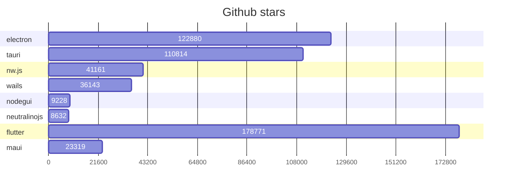

# Graphs

## Stars

```mermaid
gantt
    title Github stars
    dateFormat  X
    axisFormat %s


	section electron
	122880 : 0, 122880

	
	section tauri
	110814 : 0, 110814

	
	section nw.js
	41161 : 0, 41161

	
	section wails
	36143 : 0, 36143

	
	section nodegui
	9228 : 0, 9228

	
	section neutralinojs
	8632 : 0, 8632

	
	section flutter
	178771 : 0, 178771

	
	section maui
	23319 : 0, 23319

	
```

## Forks

```mermaid
gantt
    title Github forks
    dateFormat  X
    axisFormat %s


	section electron
	17461 : 0, 17461

	
	section tauri
	3914 : 0, 3914

	
	section nw.js
	3853 : 0, 3853

	
	section wails
	1836 : 0, 1836

	
	section nodegui
	315 : 0, 315

	
	section neutralinojs
	535 : 0, 535

	
	section flutter
	31059 : 0, 31059

	
	section maui
	1970 : 0, 1970

	
```
