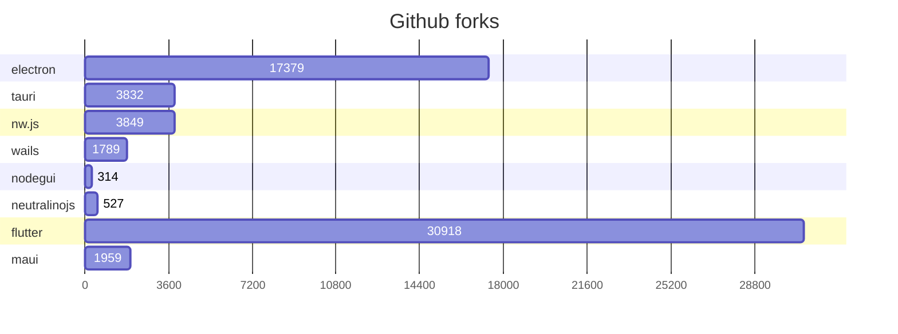

# Graphs

## Stars

```mermaid
gantt
    title Github stars
    dateFormat  X
    axisFormat %s


	section electron
	122338 : 0, 122338

	
	section tauri
	109902 : 0, 109902

	
	section nw.js
	41183 : 0, 41183

	
	section wails
	35693 : 0, 35693

	
	section nodegui
	9224 : 0, 9224

	
	section neutralinojs
	8606 : 0, 8606

	
	section flutter
	178200 : 0, 178200

	
	section maui
	23293 : 0, 23293

	
```

## Forks

```mermaid
gantt
    title Github forks
    dateFormat  X
    axisFormat %s


	section electron
	17379 : 0, 17379

	
	section tauri
	3832 : 0, 3832

	
	section nw.js
	3849 : 0, 3849

	
	section wails
	1789 : 0, 1789

	
	section nodegui
	314 : 0, 314

	
	section neutralinojs
	527 : 0, 527

	
	section flutter
	30918 : 0, 30918

	
	section maui
	1959 : 0, 1959

	
```
