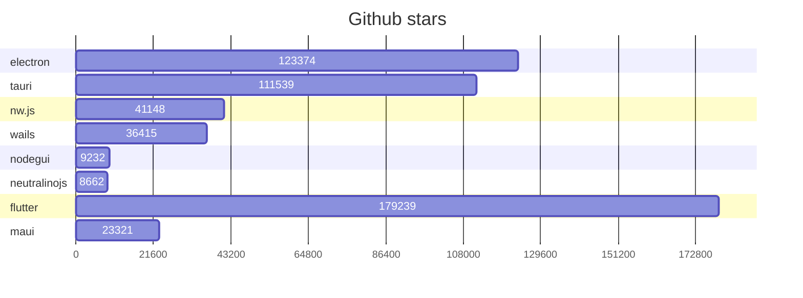
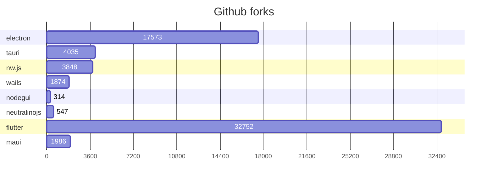

# Graphs

## Stars

```mermaid
gantt
    title Github stars
    dateFormat  X
    axisFormat %s


	section electron
	123374 : 0, 123374

	
	section tauri
	111539 : 0, 111539

	
	section nw.js
	41148 : 0, 41148

	
	section wails
	36415 : 0, 36415

	
	section nodegui
	9232 : 0, 9232

	
	section neutralinojs
	8662 : 0, 8662

	
	section flutter
	179239 : 0, 179239

	
	section maui
	23321 : 0, 23321

	
```

## Forks

```mermaid
gantt
    title Github forks
    dateFormat  X
    axisFormat %s


	section electron
	17573 : 0, 17573

	
	section tauri
	4035 : 0, 4035

	
	section nw.js
	3848 : 0, 3848

	
	section wails
	1874 : 0, 1874

	
	section nodegui
	314 : 0, 314

	
	section neutralinojs
	547 : 0, 547

	
	section flutter
	32752 : 0, 32752

	
	section maui
	1986 : 0, 1986

	
```
