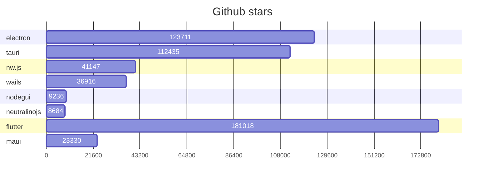
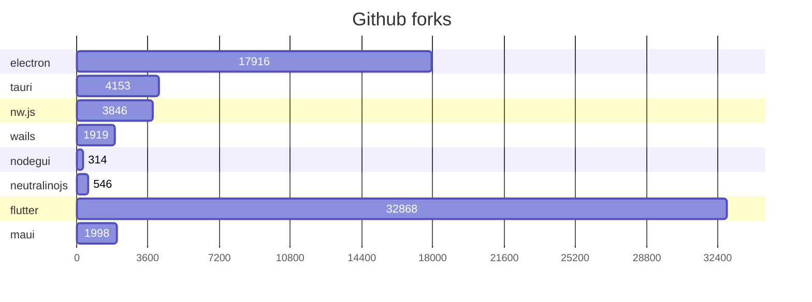

# Graphs

## Stars

```mermaid
gantt
    title Github stars
    dateFormat  X
    axisFormat %s


	section electron
	123711 : 0, 123711

	
	section tauri
	112435 : 0, 112435

	
	section nw.js
	41147 : 0, 41147

	
	section wails
	36916 : 0, 36916

	
	section nodegui
	9236 : 0, 9236

	
	section neutralinojs
	8684 : 0, 8684

	
	section flutter
	181018 : 0, 181018

	
	section maui
	23330 : 0, 23330

	
```

## Forks

```mermaid
gantt
    title Github forks
    dateFormat  X
    axisFormat %s


	section electron
	17916 : 0, 17916

	
	section tauri
	4153 : 0, 4153

	
	section nw.js
	3846 : 0, 3846

	
	section wails
	1919 : 0, 1919

	
	section nodegui
	314 : 0, 314

	
	section neutralinojs
	546 : 0, 546

	
	section flutter
	32868 : 0, 32868

	
	section maui
	1998 : 0, 1998

	
```
