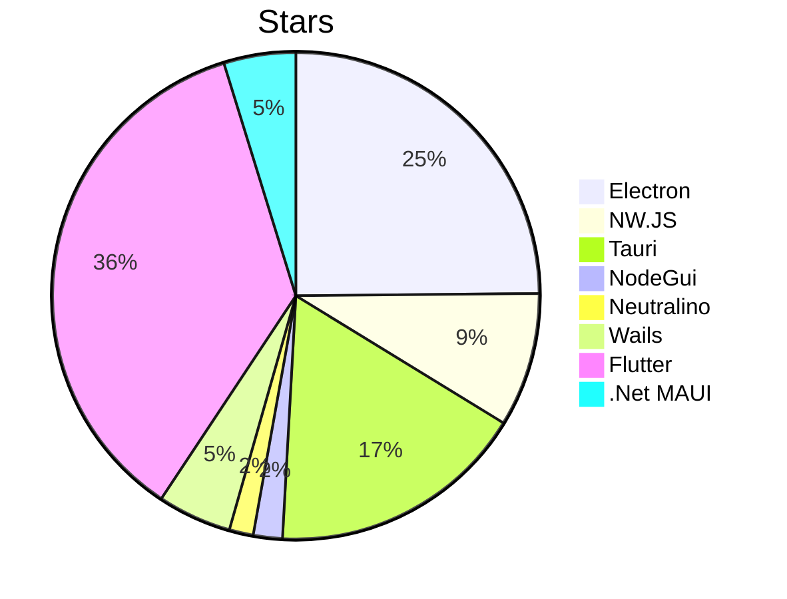
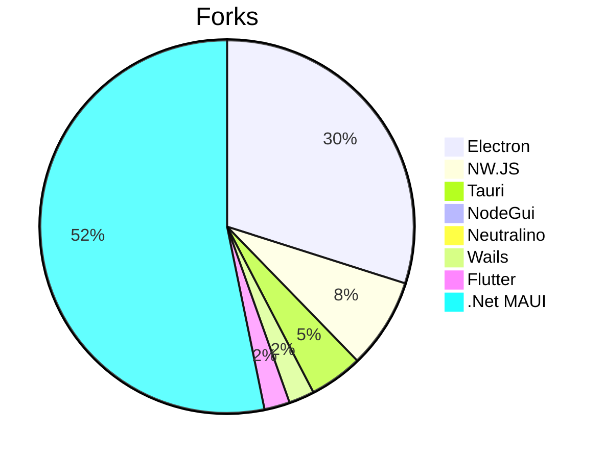

# Report
This repository was made to create an objective comparison of multiple framework that grant us to "transform" our web app to desktop application formats.

### Major characteristics
#### Stars

#### Forks

